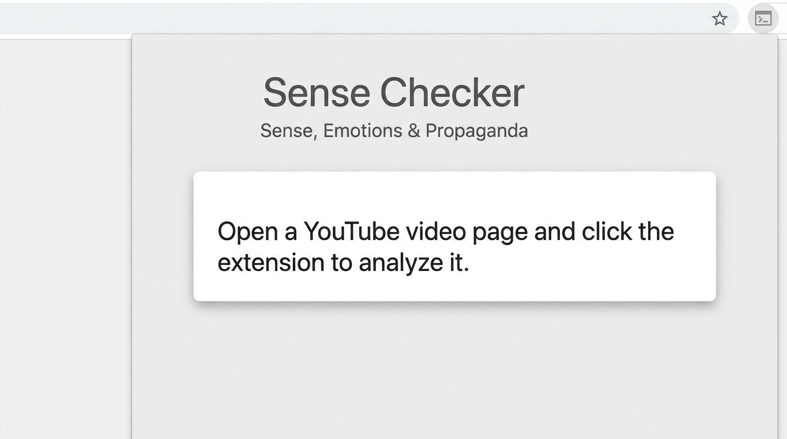
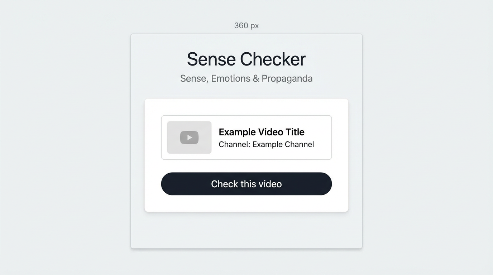
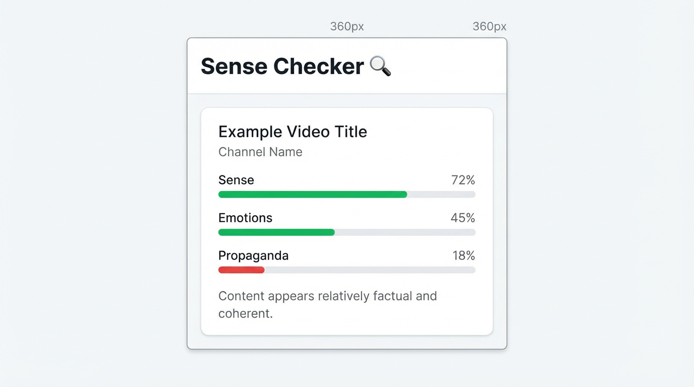

# Sense Checker

Расширение для Chrome, которое проверяет **смысл**, **эмоции** и **пропаганду** в видео на YouTube. Позволяет быстро оценить, насколько заголовок и описание выглядят фактологично, эмоционально или пропагандистски.

## Возможности

- **Смысл** — связность и фактологичность (например, ясность против сенсационности или размытости)
- **Эмоции** — степень эмоциональной окраски формулировок
- **Пропаганда** — наличие формулировок, часто связанных с манипуляцией или односторонней подачей

Анализ строится по **заголовку**, **названию канала** и **описанию** текущего видео (без анализа видео- или аудиоряда).

- **Политическое измерение** — задайте две темы (например, **пророссийская** и **проукраинская**) и при необходимости списки ключевых слов. Расширение выставляет оценку по этой шкале и показывает **розу ветров** (в виде компаса) и полосу. Подробнее: [Political_dimension.md](Political_dimension.md).

- **Пометка политических видео и «Не интересно»** — в **ленте или результатах поиска** используются сохранённые политические темы: **Сделать** сканирует страницу и помечает видео выше порога; **Не интересно** нажимает «Не интересно» в YouTube для каждого помеченного видео.

- **ИИ-проверка (по желанию)** — можно использовать **OpenAI** (GPT), **DeepSeek** или любой **OpenAI-совместимый** API. В настройках включите «Use AI for analysis», выберите провайдера и укажите API-ключ. При сбое или отсутствии настройки используется встроенная проверка по правилам.

## Скриншоты

Скриншоты всплывающего окна расширения лежат в папке [`screen/`](screen/).

**Когда вы не на странице видео** — расширение предлагает открыть страницу видео:



**На странице видео** — отображаются заголовок и кнопка «Проверить это видео»:



**После нажатия «Проверить»** — оценки по смыслу, эмоциям и пропаганде и краткое резюме:



## Установка

1. **Клонируйте или скачайте** этот репозиторий.

2. **Иконки (по желанию)**  
   Иконки уже сгенерированы в `icons/`. Чтобы пересоздать:
   ```bash
   npm install
   npm run generate-icons
   ```

3. **Подключите расширение в Chrome**
   - Откройте `chrome://extensions/`
   - Включите **Режим разработчика** (справа сверху)
   - Нажмите **Загрузить распакованное расширение**
   - Укажите папку `sense_checker` (ту, где лежит `manifest.json`)

4. **Использование**
   - Откройте страницу просмотра на YouTube (`youtube.com/watch?v=...`)
   - Нажмите на иконку Sense Checker в панели инструментов
   - Нажмите **Проверить это видео**, чтобы увидеть оценки по смыслу, эмоциям и пропаганде и краткое резюме
   - **Настройки (политические темы):** в всплывающем окне нажмите «Settings (political topics)» и задайте две метки (например, **proRussian** и **proUkrainian**) и через запятую ключевые слова для каждой. В результате отображаются **роза ветров** (ось W↔E) и полоса.
   - **Анализ списка:** откройте страницу настроек и по ссылке «Analyze a list of video URLs» вставьте несколько ссылок на YouTube (по одной на строку) и получите таблицу оценок по политическому измерению.
   - **ИИ-проверка:** в настройках в блоке «AI checker» включите «Use AI for analysis», выберите **OpenAI**, **DeepSeek** или **Custom** (и при необходимости укажите базовый URL API) и введите API-ключ. При ошибке запроса используется встроенная проверка.
   - **Пометка политических видео и «Не интересно»:** в **ленте или результатах поиска** YouTube откройте всплывающее окно — появится блок **«Mark political videos»**. Задайте **порог** (например, помечать, если любая из тем ≥ 30%). Нажмите **Make**, чтобы просканировать видимые видео; затем **Not interested**, чтобы нажать «Не интересно» в YouTube для каждого помеченного видео.

## Структура проекта

```
sense_checker/
├── Political_dimension.md   # Политические темы (актуальные) и роза ветров
├── manifest.json            # Манифест расширения (Manifest V3)
├── popup/
│   ├── popup.html          # Интерфейс всплывающего окна
│   ├── popup.css           # Стили
│   └── popup.js            # Логика и анализатор
├── content/
│   └── content.js          # На YouTube: getVisibleVideos, clickNotInterested
├── options/                 # Настройки политического измерения (темы, ключевые слова)
│   ├── options.html
│   ├── options.css
│   └── options.js
├── list/                    # Анализ списка URL видео по политическому измерению
│   ├── list.html
│   ├── list.css
│   └── list.js
├── shared/
│   ├── political-dimension.js  # Оценка по ключевым словам для двух тем
│   └── ai-checker.js           # Вызов OpenAI/DeepSeek/свой API для анализа
├── icons/
│   ├── icon16.png
│   ├── icon32.png
│   └── icon48.png
├── screen/                  # Скриншоты для README
│   ├── popup-no-video.png
│   ├── popup-before-check.png
│   └── popup-with-results.png
├── scripts/
│   └── generate-icons.js
└── package.json
```

## Лицензия

MIT
